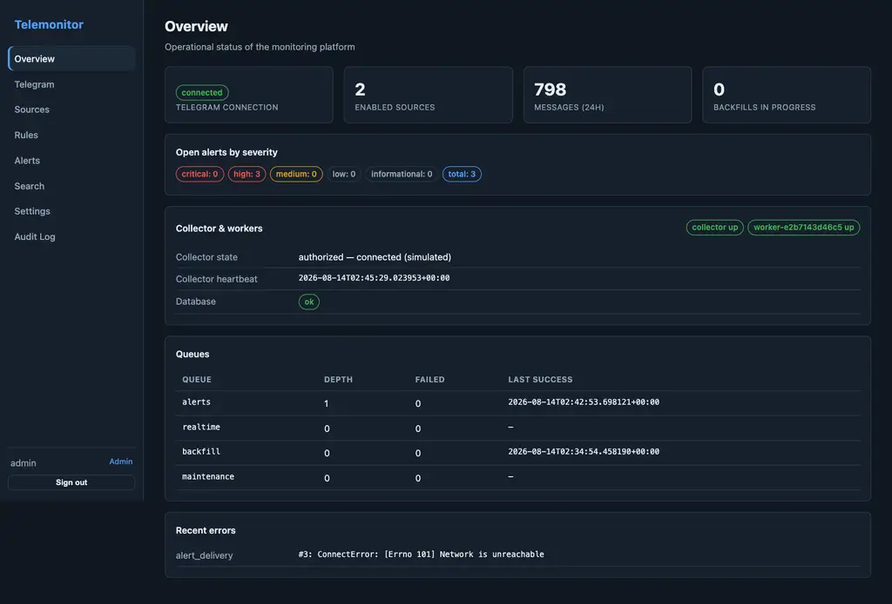
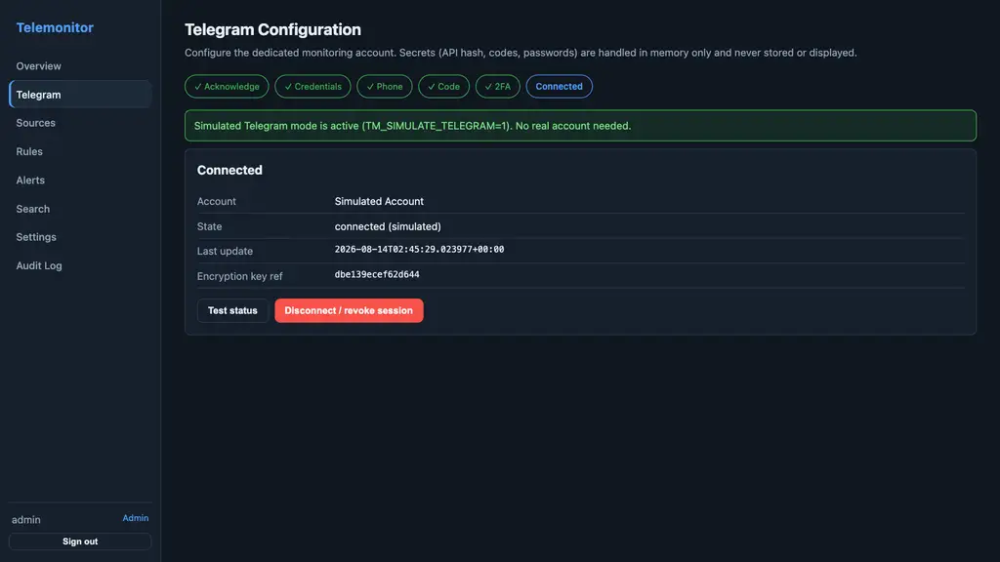
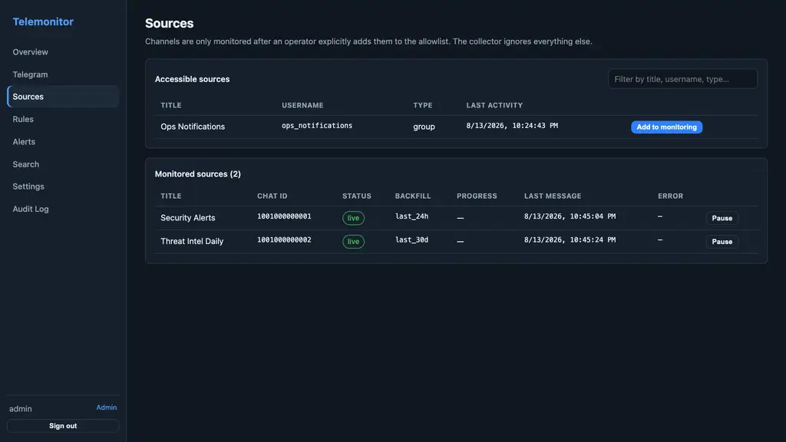
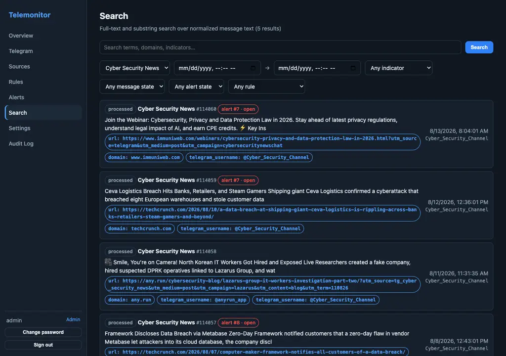
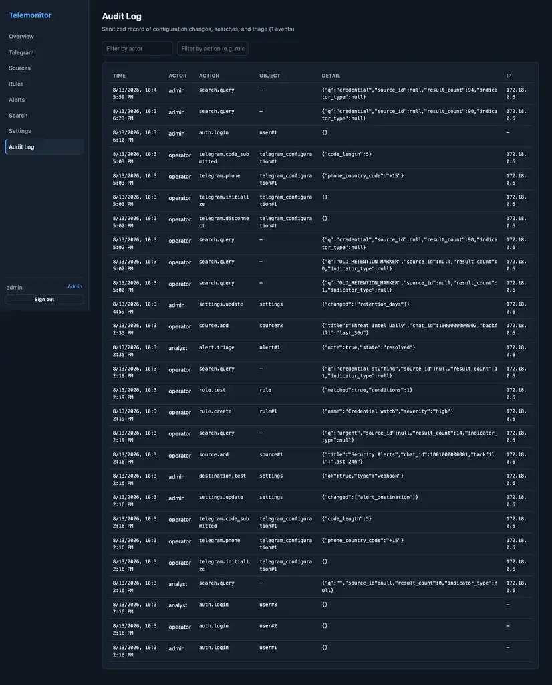

# Telemonitor

An internal, operator-managed application that monitors explicitly approved
Telegram channels using an organization-controlled Telegram account. It ingests
permitted messages, retains searchable records, runs deterministic monitors
(keywords, phrases, regex, extracted indicators), and notifies operators when a
rule matches.

**Status:** MVP implementation of the PRD in `docs/PRD.md` (see repo). Source
posts are presented as **unverified claims** with preserved provenance; any
external action requires human review. No LLM, embeddings, semantic search, or
automated attribution is used anywhere in the pipeline.

## Documentation

The operator documentation is an [Astro Starlight](https://starlight.astro.build/)
site in [`website/`](website/), deployed to GitHub Pages at
**https://zarguell.github.io/telemonitor/docs/** by
`.github/workflows/deploy-docs.yml` (the same strategy as
[Silo's project site](https://github.com/Silo-Server/siloserver.org)). Edit
Markdown under `website/src/content/docs/docs/`; the site rebuilds and deploys
on every push to `main` that touches `website/`.

```sh
cd website
bun install
bun run dev      # → http://localhost:4321
bun run build    # → website/dist/
bun run preview  # serves the built site
```

The site is configured for `https://zarguell.github.io/telemonitor/`; to host
it at another URL, set repo `SITE` / `BASE_PATH` variables — the workflow
passes them through to the Astro build.

## Architecture

| Component | Technology | Responsibility |
|---|---|---|
| Web UI | React 18 + Vite + TypeScript (nginx) | Operator configuration, search, rules, alert triage |
| API | Python FastAPI | Auth/RBAC, configuration, query API, orchestration |
| Collector | Python Telethon (or built-in simulator) | Account connection, auth flow, discovery, new-message events |
| Workers | Procrastinate (on PostgreSQL) | Realtime processing, alert delivery, backfill, maintenance |
| Database | PostgreSQL 16 (single instance) | Operational state, messages, search, queue, rules, alerts, audits |
| Migrations | Alembic | Versioned schema |

Queue layout (Procrastinate, backed by the same PostgreSQL):

- `realtime` — normalize, extract indicators, evaluate rules, create alert candidates
- `alerts` — deliver notifications, retry failed delivery, close dedupe windows
- `backfill` — paginated historical fetch + checkpoints (isolated in the collector process, concurrency 1)
- `maintenance` — retention cleanup, stale-job recovery, source reconciliation, worker health

## Development credentials (not secrets)

Everything credential-like in this repository is a **development/test value** —
there are no real secrets committed:

| Item | Value | Used for |
|---|---|---|
| `TM_SECRET_KEY` | generated per environment (`.env`); no committed default | Fernet at-rest encryption of API hash, Telethon session, bot tokens |
| `TM_AUTH_SECRET` / `TM_COLLECTOR_CONTROL_TOKEN` | generated per environment (`.env`); no committed default | JWT signing / collector control API guard |
| Bootstrap admin | `admin` + `TM_SEED_ADMIN_PASSWORD` (generated, `.env`) | First-login administrator |
| Simulator OTP | `12345` | Simulated Telegram one-time code (simulator only, never a real credential) |

Values from earlier commits of this repository (demo passwords, dev secrets)
are rejected at startup in every environment. In production:

- Set `TM_SECRET_KEY` from deployment secret management (generate with
  `python -c "from cryptography.fernet import Fernet; print(Fernet.generate_key().decode())"`).
- Never authorize a real Telegram account while running with a key that is
  committed or publicly known — its session would be recoverable by anyone
  with repo access. Outside `development`, startup refuses to boot with the
  committed default key.
- Replace all demo users before exposing the deployment.

See [Configuration](#configuration-environment) and the security properties
below.

## Screenshots

All pages of the operator UI (captured against the local stack in simulated mode):

| Page | Screenshot |
|---|---|
| Overview |  |
| Telegram Configuration |  |
| Sources |  |
| Rules |  |
| Alerts |  |
| Search |  |
| Settings |  |
| Audit Log |  |

## Quick start (local Docker)

**There are no default credentials in this repository.** Generate all secrets
into a gitignored `.env` first (compose fails fast if anything is missing):

```bash
cp .env.example .env
# fill in the four required values (generation one-liners are in .env.example):
#   TM_SECRET_KEY, TM_AUTH_SECRET, TM_COLLECTOR_CONTROL_TOKEN, TM_SEED_ADMIN_PASSWORD
docker compose up -d --build
```

The initial **Administrator** account is created at first boot from
`TM_SEED_ADMIN_PASSWORD` (username `admin`). Operator and Analyst accounts are
provisioned by an admin in Settings → Users & roles. No account, API secret,
collector token, or Fernet key with a default value exists anywhere in the
repository.

This starts PostgreSQL, migrations, API (`:8000`), collector (simulated Telegram),
worker, and web UI (`http://localhost:8080`). Demo accounts:

| Role | Bootstrapping | Permissions |
|---|---|---|
| Administrator | Created at first boot from `TM_SEED_ADMIN_PASSWORD` (username `admin`) | Everything: settings, users, retention, destinations |
| Operator | Created by an admin (Settings → Users) | Telegram config, sources, rules, search, triage |
| Analyst | Created by an admin (Settings → Users) | Search + alert triage only |

### Simulated Telegram mode

`TM_SIMULATE_TELEGRAM=1` (default in the compose file) replaces the real
Telethon client with a deterministic simulator:

- 3 channels: `@sec_alerts`, `@threat_intel_daily`, `@ops_notifications`
- one-time code: `12345`
- deterministic history (15-minute slots) so backfill is resumable and repeatable
- live messages every 20s plus an injection endpoint (see below)

Set `TM_SIMULATE_TELEGRAM=0` and enter real `api_id`/`api_hash`/phone in the
Telegram Configuration page to use a real account.

## Testing

```bash
# Backend unit/integration tests (60 tests, against the telemonitor_test database)
docker compose exec -T -e TM_DATABASE_URL=postgresql+psycopg://telemonitor:telemonitor@db:5432/telemonitor_test \
  -e TM_PROCRASTINATE_DATABASE_URL=postgresql://telemonitor:telemonitor@db:5432/telemonitor_test \
  -e DATABASE_URL=postgresql://telemonitor:telemonitor@db:5432/telemonitor_test \
  api python -m pytest tests/ -q

# End-to-end test against the running stack (99 assertions):
# auth + RBAC, full Telegram auth flow, discovery + allowlist, backfill,
# live message -> alert -> webhook delivery, deduplication, triage,
# backfill interrupt/resume, retention cleanup, audit + secret hygiene, UI,
# 2FA flow, search filters, source deletion, and the 60s latency budget.
python3 scripts/e2e.py
```

## Media storage (images)

Images from monitored messages can optionally be stored and displayed — never
analyzed (no OCR/vision in scope). Metadata-only remains the default (PRD 7.3).

- **Toggle**: Settings → Media storage → "Store and display images…" (Administrators).
  When enabled, the collector downloads images at ingest time and the
  maintenance worker backfills already-ingested messages within a minute.
- **Storage backend**: an abstracted `MediaStore` interface
  (`backend/app/services/storage.py`) — today a local filesystem store keyed by
  content SHA-256 (`TM_MEDIA_DIR`, mounted as a docker volume); an object store
  (S3) can be added later by implementing the same interface and setting
  `TM_MEDIA_STORE`.
- **Serving**: authenticated `GET /api/v1/media/{message_id}` (analyst+),
  content-type checked, cache-control private. The message detail views show
  stored images.
- **Retention**: purged media objects are deleted from the store alongside the
  messages. Only `photo` and image documents (≤ `TM_MEDIA_MAX_BYTES`) are
  stored; size is capped to avoid unbounded growth.

## Configuration (environment)

| Variable | Purpose |
|---|---|
| `TM_DATABASE_URL` | SQLAlchemy DSN (psycopg3) |
| `TM_PROCRASTINATE_DATABASE_URL` / `DATABASE_URL` | Procrastinate DSN (plain psycopg) |
| `TM_SECRET_KEY` | Fernet key for at-rest encryption of API hash, session, bot tokens. **Required in production** — deployment secret manager |
| `TM_AUTH_SECRET` | JWT signing secret |
| `TM_SIMULATE_TELEGRAM` | `1` = simulated account, `0` = real Telethon |
| `TM_COLLECTOR_CONTROL_URL` / `TM_COLLECTOR_CONTROL_TOKEN` | Private API→collector channel |
| `TM_DEFAULT_RETENTION_DAYS` | Initial content retention (admin-configurable in UI) |

The collector exposes an internal control API on port `9001` (bound to
`127.0.0.1` on the host in the dev compose; do not expose in production). It
accepts one-time codes / 2FA passwords / disconnect / discovery, and — in
simulation mode only — `POST /control/sim/message {"chat_id": ..., "text": ...}`
to inject a specific message.

## Security properties

- All API routes except `GET /api/v1/health` require authentication (httpOnly
  signed cookie, Secure-flagged outside development) with role-based access
  control (admin / operator / analyst).
- Sessions are revocable: logout and password changes bump a per-user token
  version, invalidating previously issued JWTs.
- Login is rate-limited (per username and per IP) and failed attempts are
  audited.
- The collector control API is guarded by a token compared in constant time;
  production startup refuses insecure default secrets (`TM_AUTH_SECRET`,
  `TM_COLLECTOR_CONTROL_TOKEN`, `TM_SECRET_KEY`, demo admin password).
- Webhook destinations are SSRF-guarded: loopback/private/link-local/metadata
  ranges are rejected at save and at delivery time (with an explicit
  `TM_ALLOWED_WEBHOOK_HOSTS` bypass for test environments), redirects are
  disabled, and URLs with embedded credentials are rejected.
- Demo users are seeded only on a fresh database (empty users table) — deleted
  accounts are never resurrected.
- nginx serves the UI with CSP, X-Frame-Options DENY, and nosniff headers.
- OpenAPI docs are disabled outside development.
- API hash, Telegram session, and bot tokens are encrypted at rest (Fernet).
  One-time codes and 2FA passwords exist in process memory only, are never
  persisted, and are redacted from logs and audit payloads (verified by the E2E
  suite's secret-hygiene checks).
- Message content, phone numbers, and credentials are redacted from logs by a
  global logging filter.
- Telegram configuration changes, source allowlist changes, rule changes,
  searches, alert triage, settings changes, and user management are audited in
  `audit_events` with sanitized details only.
- Allowlist is enforced server-side: the collector ignores every message from a
  chat that is not both allowlisted and enabled.
- Retention (default 90 days) deletes message content, indicators, rule matches,
  and search records; audit metadata is preserved.

## API surface (v1)

`GET /api/v1/health`, `auth/*`, `telegram/*` (status, initialize, phone, code,
password, disconnect, test), `sources` (+ `discovered`, PATCH/DELETE),
`rules` (+ `test`), `search`, `alerts` (+ triage PATCH), `settings`
(+ destination test), `users`, `audit`, `overview` — see
`backend/app/api/` for details. OpenAPI docs (`/docs`) are exposed only when `TM_ENVIRONMENT=development`.

## Reliability

- Message writes are idempotent on `(source_id, telegram_message_id)`; duplicate
  Telegram events cannot create duplicate messages or alerts.
- A message persisted before a crash is re-enqueued by the maintenance worker.
- Alert delivery is decoupled from alert creation and retried with backoff.
- Backfill checkpoints per source and resumes after interruption (verified by
  the E2E interrupt/resume test).

## Deployment notes

- Single private VM / container environment per the PRD: API, collector, worker,
  one PostgreSQL with backups, reverse proxy with TLS.
- Use separate database roles for API, collector, worker, and read-only
  reporting access.
- Set `TM_SECRET_KEY`, `TM_AUTH_SECRET`, and admin credentials via deployment
  secret management; never in the operator UI.
- Retention value must be approved for the deployment environment before
  production use.
