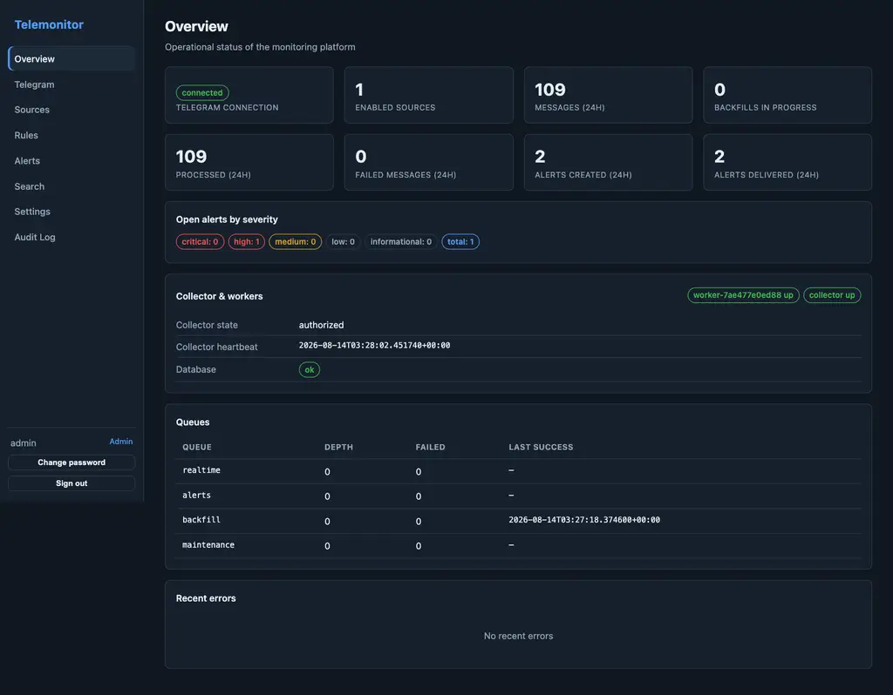
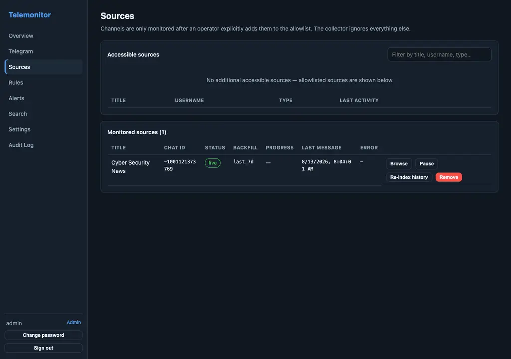
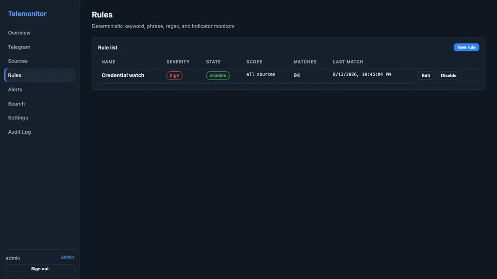
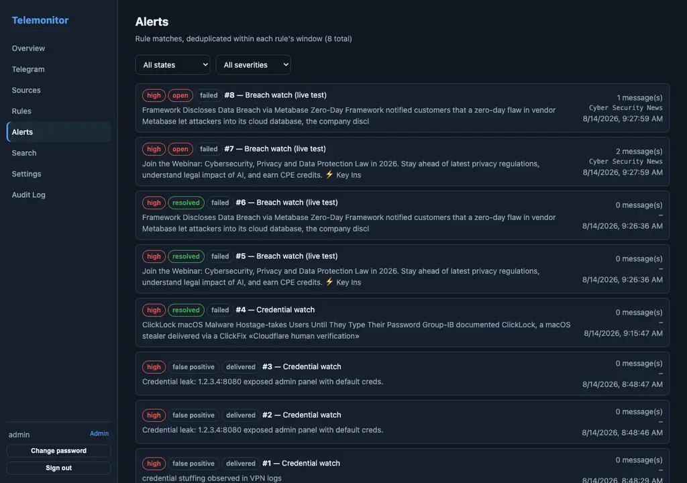
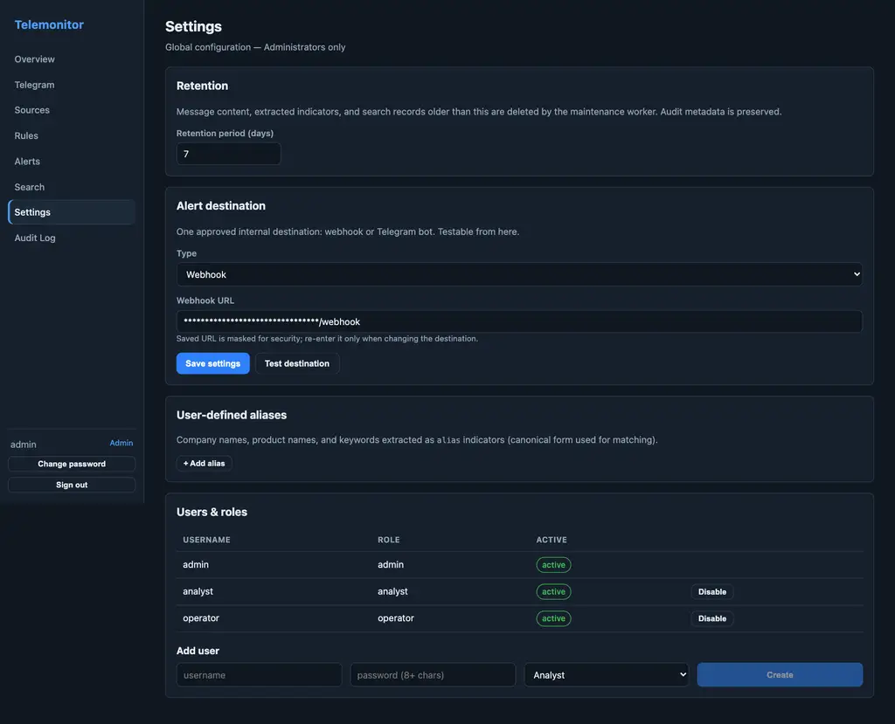

Run the full stack locally with Docker. **There are no default credentials in
the repository.** Generate all secrets into a gitignored `.env` first (compose
fails fast if anything is missing):

```bash
cp .env.example .env
# fill in the four required values (generation one-liners are in .env.example):
#   TM_SECRET_KEY, TM_AUTH_SECRET, TM_COLLECTOR_CONTROL_TOKEN, TM_SEED_ADMIN_PASSWORD
docker compose up -d --build
```

This starts PostgreSQL, migrations, API (`:8000`), collector, worker, and the
web UI at `http://localhost:8080`.

The initial **Administrator** account is created at first boot from
`TM_SEED_ADMIN_PASSWORD` (username `admin`). Operator and Analyst accounts are
provisioned by an admin in Settings → Users & roles. No account, API secret,
collector token, or Fernet key with a default value exists anywhere in the
repository.

| Role | Bootstrapping | Permissions |
|---|---|---|
| Administrator | Created at first boot from `TM_SEED_ADMIN_PASSWORD` (username `admin`) | Everything: settings, users, retention, destinations |
| Operator | Created by an admin (Settings → Users) | Telegram config, sources, rules, search, triage |
| Analyst | Created by an admin (Settings → Users) | Search + alert triage only |

## Simulated Telegram mode

`TM_SIMULATE_TELEGRAM=1` (default in the compose file) replaces the real
Telethon client with a deterministic simulator:

- 3 channels: `@sec_alerts`, `@threat_intel_daily`, `@ops_notifications`
- one-time code: `12345`
- deterministic history (15-minute slots) so backfill is resumable and repeatable
- live messages every 20s plus an injection endpoint (see Configuration)

Set `TM_SIMULATE_TELEGRAM=0` and enter real `api_id`/`api_hash`/phone in the
Telegram Configuration page to use a real account.

## Operator UI

All pages of the operator UI, captured against the local stack in simulated
mode:

| Page | Screenshot |
|---|---|
| Overview |  |
| Telegram Configuration |  |
| Sources |  |
| Rules |  |
| Alerts |  |
| Search |  |
| Settings |  |
| Audit Log |  |

## Testing

```bash
# Backend unit/integration tests (60 tests, against the telemonitor_test database)
docker compose exec -T -e TM_DATABASE_URL=postgresql+psycopg://telemonitor:telemonitor@db:5432/telemonitor_test \
  -e TM_PROCRASTINATE_DATABASE_URL=postgresql://telemonitor:telemonitor@db:5432/telemonitor_test \
  -e DATABASE_URL=postgresql://telemonitor:telemonitor@db:5432/telemonitor_test \
  api python -m pytest tests/ -q

# End-to-end test against the running stack (99 assertions):
# auth + RBAC, full Telegram auth flow, discovery + allowlist, backfill,
# live message -> alert -> webhook delivery, deduplication, triage,
# backfill interrupt/resume, retention cleanup, audit + secret hygiene, UI,
# 2FA flow, search filters, source deletion, and the 60s latency budget.
python3 scripts/e2e.py
```

## Next steps

- [Installation](installation) — hardening and production deployment notes
- [Configuration](configuration) — every environment variable
